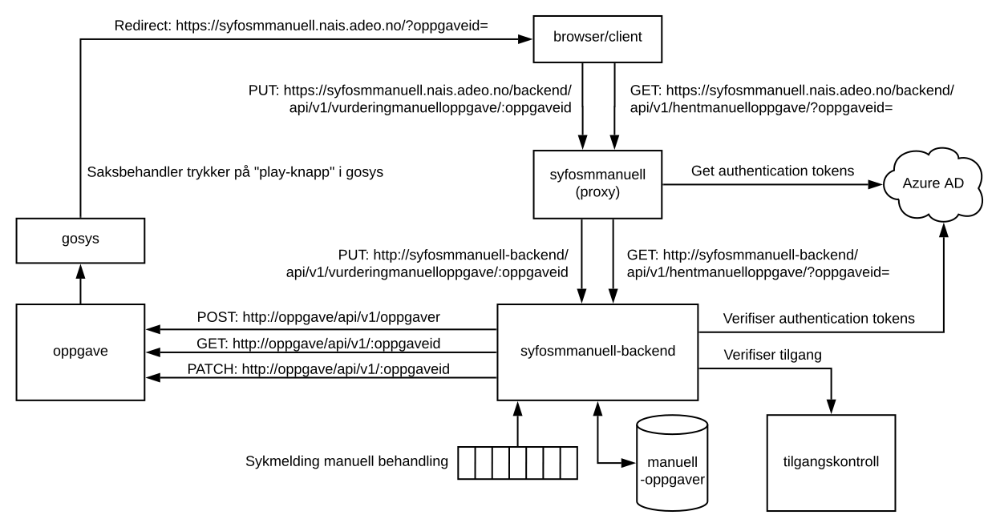

# syfosmmanuell




## Om syfosmmanuell

Frontend for manuell behandling av sykemeldinger. Laget med React og Typescript. Statiske build-filer hostes fra en express-server, som tar hånd om autentisering mot Azure AD og fungerer som en proxy for kall downstream til API. Serveren er basert på dette [eksempelet](https://github.com/navikt/security-blueprints/tree/master/examples/oidc-login-azuread/login-proxy-nodejs).

### Environment-variable

Frontend-appen bruker en pakke som er bakt inn i react-scripts til å "injekte" environment-variable i de statiske filene som bygges. Alle environment-variable som skal være tilgjengelige client-side må derfor defineres i [/.github/workflows/deploy](deploy.yml) / [/.github/workflows/devdeploy](devdeploy.yml)

## Installering

Klon bibliotek og last ned avhengigheter

```bash
git clone <repo-link>
npm install
```

## Bruk

### Start local dev-server

Dette vil starte en web-server med "hot reloading". Her vil environmentvariabelen `NODE_ENV` settes automatisk til `development`. Mockdata vil da lastes inn fra `src/mock`-mappen.

```bash
npm start
```

Det er også mulig å starte den express-serveren med Autentisering og proxy, men det vil ikke fungere ettersom "redirect url" for lokal bruk ikke er registrert hos Azure og API-et ikke kjører lokalt. Dersom man fortsatt vil kjøre opp express-serveren kan man kjøre

```bash
cd server
npm run start-dev
```

### Kjør tester med jest

```bash
npm test
```

### Bygg for produksjon

```bash
npm build
```

Genererer statiske filer til "/build"-mappen
