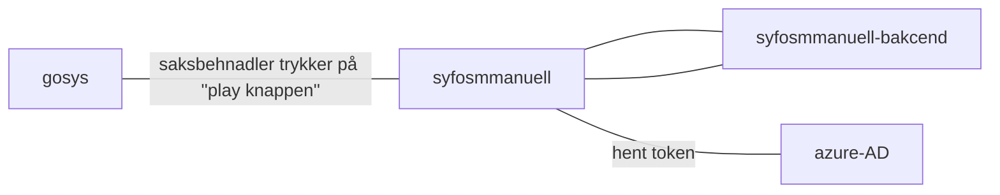

# syfosmmanuell

Saksbehandlerfrontend for manuell behandling av tilbakedaterte sykemeldinger. Tillater saksbehandler å `godkjenne` eller `godkjenne med merknad`. Merknader vises for bruker sluttbruker.

Applikasjonen er en NextJS app med API routes for data fetching og lagring.
- Frontenden rendres og prepopuleres med en sykmelding som skal behandles (SSR).
- Dataen er fetched fra modiacontextholder og syfosmmanuell-backend. For hver av disse veksles inn i en token spesifikt for tjenesten som skal prates med.
- Når behandlingen er gjennomført utføres det et POST kall til syfosmmanuell-backend, her veksles også token.

`client browser --> next API routes som veksler tokens --> downstream APIs`

En demoside er offentlig tilgjengelig på: https://syfosmmanuell.labs.nais.io/?oppgaveid=1


## Oversikt over applikasjonens houved flyt


## Utvikling

Pass på at du har yarn installert, om du ikke har det: `npm i -g yarn`

### Tilgang til Github Package Registry

Siden vi bruker avhengigheter som ligger i GPR, så må man sette opp tilgang til GPR med en PAT (personal access token) som har `read:packages`. Du kan [opprette PAT her](https://github.com/settings/tokens). Dersom du har en PAT som du bruker for tilgang til maven-packages i github kan du gjenbruke denne.

I din `.bashrc` eller `.zshrc`, sett følgende miljøvariabel:

`export NPM_AUTH_TOKEN=<din PAT med read:packages>`

### Utvikling:
```bash
$ yarn
$ yarn start
```
URL: http://localhost:3000/?oppgaveid=123456

Vil laste miljøvariabler fra `/.env.development`

## Test
Bruker React Testing Library for
```bash
$ yarn test
```

## Testing av tjenesteflyt i testmiljø
Applikasjonen er tilgjengelig i testmiljø på https://syfosmmanuell.dev.intern.nav.no/?oppgaveid={oppgaveid} lokalt via `naisdevice` eller via utviklerimage. `oppgaveid` referer til oppgaven som opprettes i `syfosmmanuell-backend` og lagres i tilhørende database.
