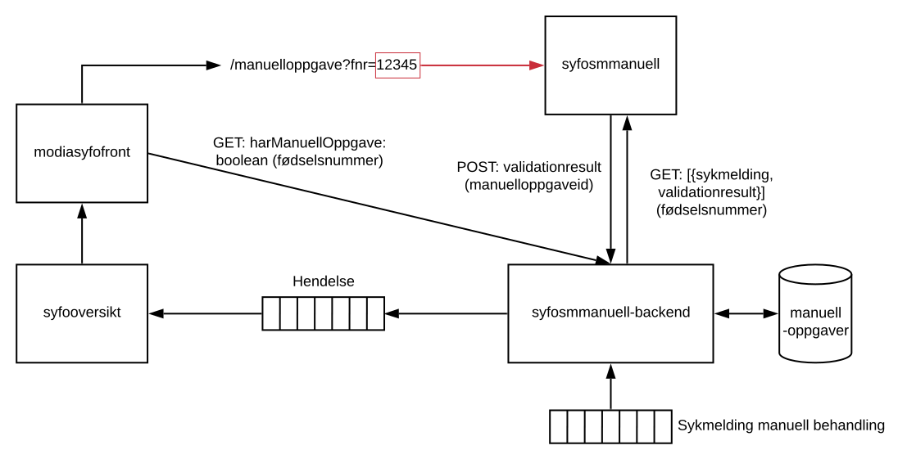

# syfosmmanuell

## Om syfosmmanuell
Frontend til manuell behandling av sykemelding for saksbehandlere. Laget med React og Typescript. Figuren under viser systemarkitektur og tilknytning til Modia.



## Installering
Klon bibliotek og last ned avhengigheter
```bash
git clone <repo-link>
npm install
```

## Bruk

### Start local dev-server
```bash
npm start
```

### Kjør tester med jest
```bash
npm run test
```
For watch mode med automatisk rerun av tester, kan følgende kommando kjøres
```bash
npm run test-watch
```

### Bygg for produksjon
```bash
npm run build-prod
```
Genererer statiske filer til "/dist"-mappen